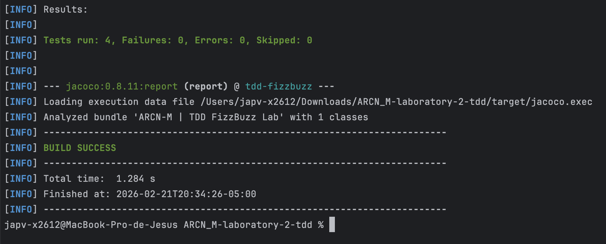
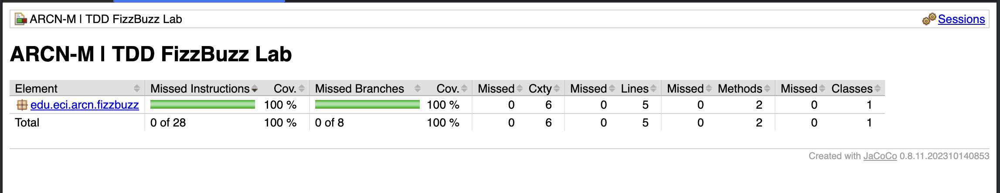

# 🧪 TDD FizzBuzz Laboratory
## Test-Driven Development with FizzBuzz in GitHub Codespaces

[](https://www.oracle.com/java/)
[](https://maven.apache.org/)
[](https://junit.org/junit5/)
[](https://www.jacoco.org/jacoco/)
[](https://github.com/features/codespaces)
[](LICENSE)

> **Business-Centric Architecture (ARCN_M)** — Laboratory 2  
> Practical application of **Test-Driven Development (TDD)** through the classic *FizzBuzz* exercise in Java, following the **Red-Green-Refactor** cycle with full coverage validation via **JaCoCo**.

---

## 📋 **Table of Contents**

- [Overview](#-overview)
- [TDD Methodology](#-tdd-methodology)
- [FizzBuzz Rules](#-fizzbuzz-rules)
- [Project Structure](#-project-structure)
- [Implementation](#-implementation)
- [Testing Results](#-testing-results)
- [CI/CD Pipeline](#-cicd-pipeline)
- [Installation and Usage](#-installation-and-usage)
- [Technologies Used](#️-technologies-used)
- [Author](#-author)
- [License](#-license)
- [Additional Resources](#-additional-resources)

---

## 🌟 **Overview**

This laboratory demonstrates the practical application of **Test-Driven Development (TDD)** — a software engineering discipline in which tests are written _before_ the production code. Using the classic *FizzBuzz* problem as a vehicle, students experience the full TDD cycle in a structured, reproducible **GitHub Codespaces** environment.

### 🎯 Learning Objectives

- ✅ **Understand** the Red-Green-Refactor cycle as a disciplined development practice
- ✅ **Write** unit tests before implementing any business logic
- ✅ **Implement** the minimum necessary code to pass each test
- ✅ **Validate** code quality through **JaCoCo** coverage reports (≥ 85%)
- ✅ **Integrate** TDD into a CI/CD pipeline with **GitHub Actions**

### 💼 Business Context

In **enterprise software development**, TDD provides measurable benefits:

- 🔧 **Fewer defects**: Tests act as a safety net during development and refactoring
- 🚀 **Faster feedback**: Issues are caught immediately, not at integration time
- 🧪 **Self-documenting code**: Tests describe expected behavior explicitly
- 👥 **Team confidence**: Refactoring becomes safe with a comprehensive test suite
- 💰 **Lower maintenance cost**: Clean, well-tested code reduces long-term technical debt

---

## 🔄 **TDD Methodology**

**Test-Driven Development** follows a strict three-phase cycle known as **Red-Green-Refactor**:

| Phase | Color | Action | Goal |
|-------|-------|--------|------|
| **Write a failing test** | 🔴 Red | Add a test for unimplemented behavior | Define expected behavior first |
| **Make the test pass** | 🟢 Green | Write the minimum code to pass the test | Prove the behavior works |
| **Improve the code** | 🔵 Refactor | Clean up without breaking tests | Maintain quality and clarity |

> *"Write the test. Watch it fail. Make it pass. Refactor. Repeat."*  
> — [Kent Beck](https://en.wikipedia.org/wiki/Kent_Beck), _Extreme Programming Explained_

This cycle enforces the **FIRST principles** for unit tests:

- ⚡ **F**ast — tests run in milliseconds
- 🔒 **I**ndependent — no test depends on another
- 🔁 **R**epeatable — same result every run, any environment
- ✅ **S**elf-validating — pass or fail, no manual inspection
- ⏰ **T**imely — written before production code

---

## 🎮 **FizzBuzz Rules**

*FizzBuzz* is a classic programming exercise governed by four rules. Given an integer $n$:

$$
\text{fizzbuzz}(n) =
\begin{cases}
\text{"FizzBuzz"} & \text{if } n \equiv 0 \pmod{3} \text{ and } n \equiv 0 \pmod{5} \\
\text{"Fizz"} & \text{if } n \equiv 0 \pmod{3} \\
\text{"Buzz"} & \text{if } n \equiv 0 \pmod{5} \\
\text{String}(n) & \text{otherwise}
\end{cases}
$$

| Input | Output | Rule |
|-------|--------|------|
| `1` | `"1"` | Not divisible by 3 or 5 |
| `3` | `"Fizz"` | Divisible by 3 |
| `5` | `"Buzz"` | Divisible by 5 |
| `15` | `"FizzBuzz"` | Divisible by both 3 and 5 |
| `0` | `"FizzBuzz"` | Edge case: 0 is a multiple of any integer |

---

## 📁 **Project Structure**

```
tdd-fizzbuzz/
│
├── .gitignore
├── pom.xml
├── README.md
├── LICENSE
│
├── .devcontainer/
│   └── devcontainer.json
│
├── .github/
│   └── workflows/
│       └── ci.yml
│
├── assets/
│   └── images/
│       ├── 01-unit-tests-execution.png
│       └── 02-jacoco-unit-test-coverage-report.png
│
└── src/
    ├── main/
    │   └── java/
    │       └── edu/
    │           └── eci/
    │               └── arcn/
    │                   └── fizzbuzz/
    │                       └── FizzBuzz.java
    │
    └── test/
        └── java/
            └── edu/
                └── eci/
                    └── arcn/
                        └── fizzbuzz/
                            └── FizzBuzzTest.java
```

---

## 🔨 **Implementation**

### Phase 🔴 Red — Tests First

Tests are written before any implementation exists. The test file defines the complete expected behavior of `FizzBuzz`:

```java
package edu.eci.arcn.fizzbuzz;

import static org.junit.jupiter.api.Assertions.assertEquals;

import java.util.List;
import org.junit.jupiter.api.Test;

/**
 * Unit tests for FizzBuzz following TDD (Red-Green-Refactor) cycle.
 *
 * @author Jesús Pinzón
 * @version 1.0
 * @since 2026-02-21
 */
class FizzBuzzTest {

    private final FizzBuzz fizzBuzz = new FizzBuzz();

    @Test
    void testFizzBuzzShouldReturnNumberAsStringForNonMultiples() {
        // Arrange
        List<Integer> inputs = List.of(1, 2, 4, 7, 11, 13);

        // Act & Assert
        for (int input : inputs) {
            assertEquals(String.valueOf(input), this.fizzBuzz.fizzbuzz(input));
        }
    }

    @Test
    void testFizzBuzzShouldReturnFizzForMultiplesOf3() {
        // Arrange
        List<Integer> inputs = List.of(3, 6, 9, -3);

        // Act & Assert
        for (int input : inputs) {
            assertEquals("Fizz", this.fizzBuzz.fizzbuzz(input));
        }
    }

    @Test
    void testFizzBuzzShouldReturnBuzzForMultiplesOf5() {
        // Arrange
        List<Integer> inputs = List.of(5, 25, 1000, -5);

        // Act & Assert
        for (int input : inputs) {
            assertEquals("Buzz", this.fizzBuzz.fizzbuzz(input));
        }
    }

    @Test
    void testFizzBuzzShouldReturnFizzBuzzForMultiplesOf3And5() {
        // Arrange
        List<Integer> inputs = List.of(0, 15, 30, 45, -15);

        // Act & Assert
        for (int input : inputs) {
            assertEquals("FizzBuzz", this.fizzBuzz.fizzbuzz(input));
        }
    }
}
```

### Phase 🟢 Green — Minimum Implementation

The minimum production code to make all 4 tests pass:

```java
package edu.eci.arcn.fizzbuzz;

/**
 * FizzBuzz game logic.
 *
 * Returns "FizzBuzz" for multiples of 3 and 5, "Fizz" for multiples
 * of 3, "Buzz" for multiples of 5, and the number as string otherwise.
 *
 * @author Jesús Pinzón
 * @version 1.0
 * @since 2026-02-21
 */
public class FizzBuzz {

    public String fizzbuzz(int n) {
        if (n % 3 == 0 && n % 5 == 0) return "FizzBuzz";
        if (n % 3 == 0) return "Fizz";
        if (n % 5 == 0) return "Buzz";
        return String.valueOf(n);
    }
}
```

### Phase 🔵 Refactor

The implementation above already satisfies **clean code** standards — no refactoring was required in this iteration. The guard-clause pattern keeps cyclomatic complexity minimal and the method self-documenting.

---

## ✅ **Testing Results**

### Unit Test Execution

All **4 unit tests** executed successfully with **0 failures, 0 errors**, and **0 skipped** after applying TDD:



### JaCoCo Coverage Report

The project achieved **100% line coverage** and **100% branch coverage** — well above the enforced minimum of <u>85%</u>:



| Metric | Covered | Total | Coverage |
|--------|---------|-------|----------|
| **Instructions** | 28 | 28 | **100%** |
| **Branches** | 8 | 8 | **100%** |
| **Lines** | 5 | 5 | **100%** |
| **Methods** | 2 | 2 | **100%** |
| **Classes** | 1 | 1 | **100%** |

### Running Tests Locally

```bash
# Run unit tests only
mvn test

# Run tests + generate JaCoCo report (enforces 85% minimum)
mvn verify

# View HTML coverage report
open target/site/jacoco/index.html
```

---

## ⚙️ **CI/CD Pipeline**

The project integrates a **GitHub Actions** pipeline with three sequential jobs. Each job depends on the success of the previous one:

```
build ──► test ──► deploy
```

The `test` job runs `mvn verify`, which enforces the **85% coverage threshold** via JaCoCo. If coverage falls below this threshold, the pipeline fails and the `deploy` job is blocked.

```yaml
# .github/workflows/ci.yml (excerpt)
jobs:
  build:   { runs-on: ubuntu-latest }
  test:    { needs: build }   # mvn verify → JaCoCo check (min 85%)
  deploy:  { needs: test, if: push to main }
```

> The `deploy` job only executes on direct pushes to `main`, never on pull requests.

---

## 🚀 **Installation and Usage**

### Prerequisites

- **Java 17+** — [Download Java](https://www.oracle.com/java/technologies/downloads/)
- **Maven 3.8+** — [Install Maven](https://maven.apache.org/install.html)
- **Git** — [Install Git](https://git-scm.com/downloads)

### Local Setup

```bash
# Clone repository
git clone https://github.com/JAPV-X2612/ARCN_M-laboratory-2-tdd.git
cd ARCN_M-laboratory-2-tdd

# Compile project
mvn compile

# Run tests
mvn test

# Run tests + coverage report
mvn verify
```

### GitHub Codespaces Setup

1. Navigate to the repository on GitHub
2. Click **Code** → **Codespaces** → **Create codespace on main**
3. Wait for the container to initialize via `.devcontainer/devcontainer.json`
4. Run tests directly in the integrated terminal:
   ```bash
   mvn verify
   ```

### Initialize from Scratch

```bash
mvn archetype:generate \
  -DgroupId=edu.eci.arcn \
  -DartifactId=tdd-fizzbuzz \
  -Dpackage=edu.eci.arcn.fizzbuzz \
  -DarchetypeArtifactId=maven-archetype-quickstart \
  -DinteractiveMode=false
```

---

## 🛠️ **Technologies Used**

| Technology | Version | Purpose |
|------------|---------|---------|
| **Java** | 17+ | Primary programming language |
| **Maven** | 3.8+ | Build automation and dependency management |
| **JUnit Jupiter** | 5.10.2 | Unit testing framework |
| **JaCoCo** | 0.8.11 | Code coverage measurement and enforcement |
| **GitHub Actions** | — | CI/CD pipeline automation |
| **GitHub Codespaces** | — | Cloud-based development environment |

### Key Maven Dependencies

```xml
<dependencies>
    <dependency>
        <groupId>org.junit.jupiter</groupId>
        <artifactId>junit-jupiter</artifactId>
        <version>5.10.2</version>
        <scope>test</scope>
    </dependency>
</dependencies>
```

---

## 👥 **Author**

<table>
  <tr>
    <td align="center">
      <a href="https://github.com/JAPV-X2612">
        
        <br />
        <sub><b>Jesús Alfonso Pinzón Vega</b></sub>
      </a>
      <br />
      <sub>Full Stack Developer</sub>
    </td>
  </tr>
</table>

---

## 📄 **License**

This project is licensed under the **Apache License, Version 2.0** — see the [LICENSE](LICENSE) file for details.

```
Copyright 2026 Jesús Alfonso Pinzón Vega

Licensed under the Apache License, Version 2.0 (the "License");
you may not use this file except in compliance with the License.
You may obtain a copy of the License at

    http://www.apache.org/licenses/LICENSE-2.0

Unless required by applicable law or agreed to in writing, software
distributed under the License is distributed on an "AS IS" BASIS,
WITHOUT WARRANTIES OR CONDITIONS OF ANY KIND, either express or implied.
See the License for the specific language governing permissions and
limitations under the License.
```

---

## 🔗 **Additional Resources**

### Test-Driven Development

- [Kent Beck — *Test-Driven Development: By Example*](https://www.oreilly.com/library/view/test-driven-development/0321146530/)
- [Martin Fowler — Is TDD Dead?](https://martinfowler.com/articles/is-tdd-dead/)
- [TDD Guide — Baeldung](https://www.baeldung.com/cs/test-driven-development)

### JUnit 5 & JaCoCo

- [JUnit 5 User Guide](https://junit.org/junit5/docs/current/user-guide/)
- [JaCoCo Documentation](https://www.jacoco.org/jacoco/trunk/doc/)
- [JaCoCo Maven Plugin](https://www.jacoco.org/jacoco/trunk/doc/maven.html)

### Java & Maven

- [Oracle Java 17 Documentation](https://docs.oracle.com/en/java/javase/17/)
- [Maven Getting Started Guide](https://maven.apache.org/guides/getting-started/)
- [Maven Surefire Plugin](https://maven.apache.org/surefire/maven-surefire-plugin/)

### CI/CD & GitHub

- [GitHub Actions — Java with Maven](https://docs.github.com/en/actions/automating-builds-and-tests/building-and-testing-java-with-maven)
- [GitHub Codespaces Documentation](https://docs.github.com/en/codespaces)
- [Dev Container Specification](https://containers.dev/)

### Clean Code & Best Practices

- [Robert C. Martin — *Clean Code*](https://www.oreilly.com/library/view/clean-code-a/9780136083238/)
- [FIRST Principles for Unit Tests — Baeldung](https://www.baeldung.com/java-unit-testing-best-practices)
- [Arrange-Act-Assert Pattern](https://java-design-patterns.com/patterns/arrange-act-assert/)

---

⭐ **If you found this laboratory helpful, please consider giving it a star!** ⭐
